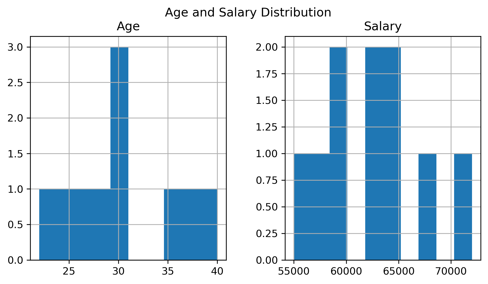
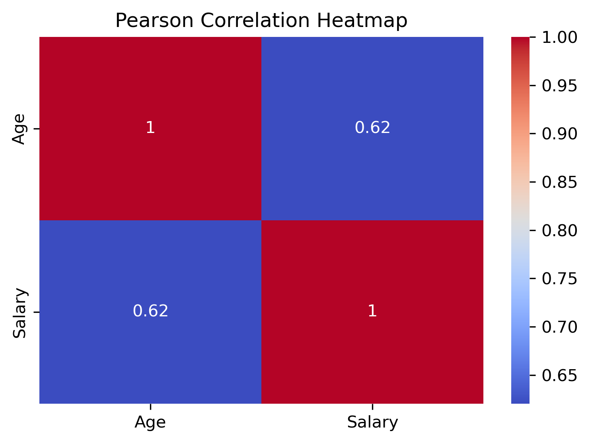
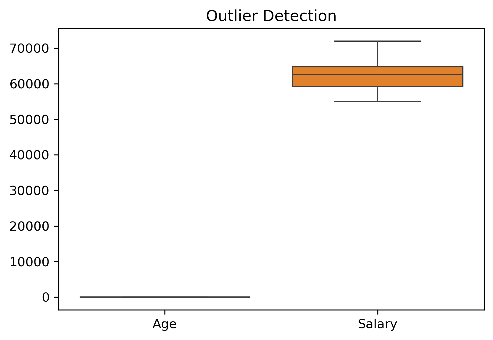

# 📊 Data Cleaning and Visualization with Pearson Correlation

## 📌 Overview
This project focuses on cleaning a messy dataset and performing data visualization to extract meaningful insights. The main objective is to analyze relationships between variables using the Pearson correlation method.

---

## 🧹 Data Cleaning

The dataset contained several issues:
- Missing values in Age, Salary, and Join Date
- Duplicate records
- Incorrect formats (e.g., "thirty-eight", "sixty five thousand")
- Inconsistent country values (AU vs AUS)

### ✔ Cleaning Steps:
- Converted text values into numeric values
- Filled missing values using mean and mode
- Removed duplicate rows
- Standardized country names
- Converted Join Date into datetime format

---

## 📊 Data Visualization

### 📈 Histogram
Used to visualize the distribution of Age and Salary.

### 🔥 Pearson Correlation Heatmap
Used to identify relationships between variables.

**Result:**
- Moderate positive correlation (~0.63) between Age and Salary
- Indicates that as age increases, salary tends to increase

> ⚠️ Correlation does not imply causation.

---

### ⚠️ Outlier Detection (Boxplot)
Used to identify extreme values that may affect analysis.

---

## 🛠️ Technologies Used
- Python
- Pandas
- Matplotlib
- Seaborn
- VS Code

---

## 📷 Output

### Histogram

### Heatmap

### Boxplot

---

## 🎥 Presentation
A short video (3 minutes) explains:
- Data cleaning process
- Visualization insights
- Correlation analysis
- Outlier detection

---

## ✅ Conclusion
Data cleaning improved the dataset quality, and visualization helped identify meaningful patterns and relationships.

---